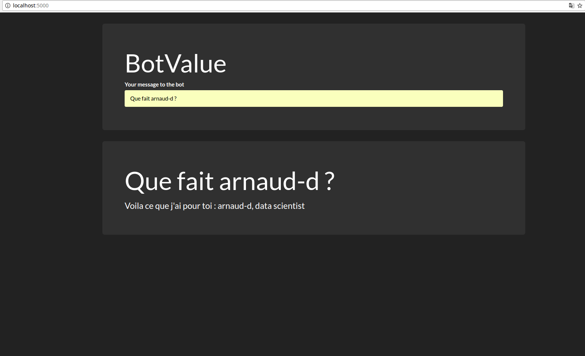

# Bot Value

## Install

Either run these following commands
```
pip install -r requirements.txt
git clone https://github.com/gunthercox/ChatterBot.git
cp -r ChatterBot/chatterbot ./
cp -r chatterbot_fork/* chatterbot/
rm -rf ChatterBot/
```

Or the installer : 
```
chmod +x install.sh
./install.sh
```

## Run BotValue

### Terminal Version

Run `python .`

### Web Version

Run `python . --web-app` and go to `localhost:5000`



> Debug Mode : pass `--debug` as an argument

## Documentation

[Chatterbot Documentation](http://chatterbot.readthedocs.io/en/stable/)

## Key Elements

See into chatterbot, the logic adapters. 
A **QueryAdapter** has been implemented for the v0.2 of the bot ([here](chatterbot_fork/logic/query_adapter.py))


